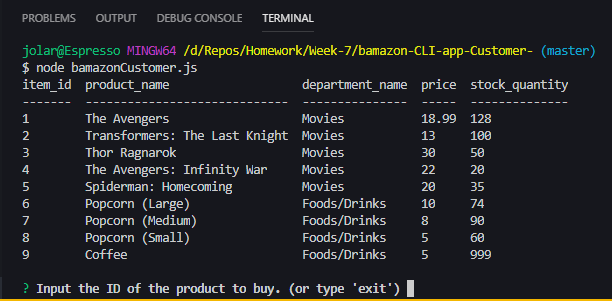
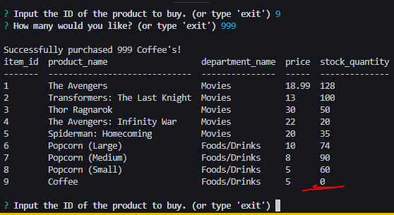
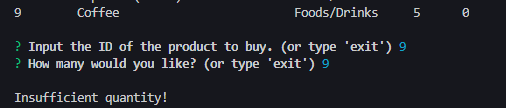
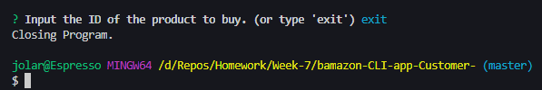

# bamazon-customer-CLI-app
A MySQL database, coded for use by customers.
Customer's cannot directly change the database, with the exception of lowering product supplies
via outright buying them.

# Requirements:
- You will need a database to run the schema and host the connection.
- for minimal compatibility issues, mysql would be preferable.
- And DO NOT forget to update the passwords in the app to your own.

# Libraries Used:
- For terminal prompt input:
<br>node-inquirer: https://github.com/SBoudrias/Inquirer.js/<br>

- For database code:
<br>mysql: https://github.com/mysqljs/mysql

- For rendering the table data in the console:
<br>console.table: included natively

# Setup:
- Start your database, editing the port, user, and password in the app to those configured to your current pc
- Open the terminal in a js code editor, and install the necessary packages by typing this:
```
npm install
```
or just
```
npm i
```

# How it Works:
Assuming the database has been started,
- Once started, the program, on successful connection, renders the table data and prompts the customer.

- On choosing a product to buy, the customer is then asked how many to buy.

- The supply is then lowered by the amount bought.
- If there was not enough supply to satisfy the user's order. . .

- Tells user that there was not enough, then returns to start.

- And when the user is done, the user may type 'exit' at any prompt to close the process.


# Future Notes:
- make an administrative program that allows them to directly change the table, add entries, etc.


